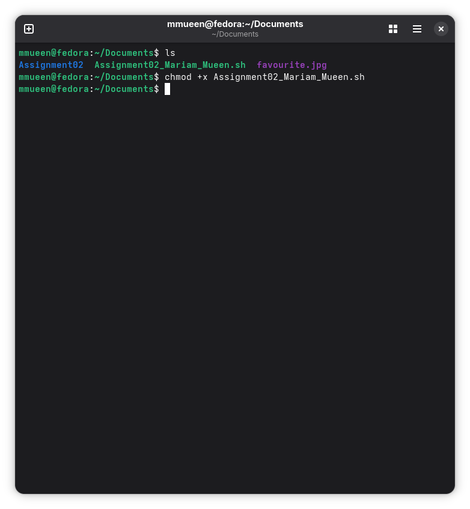
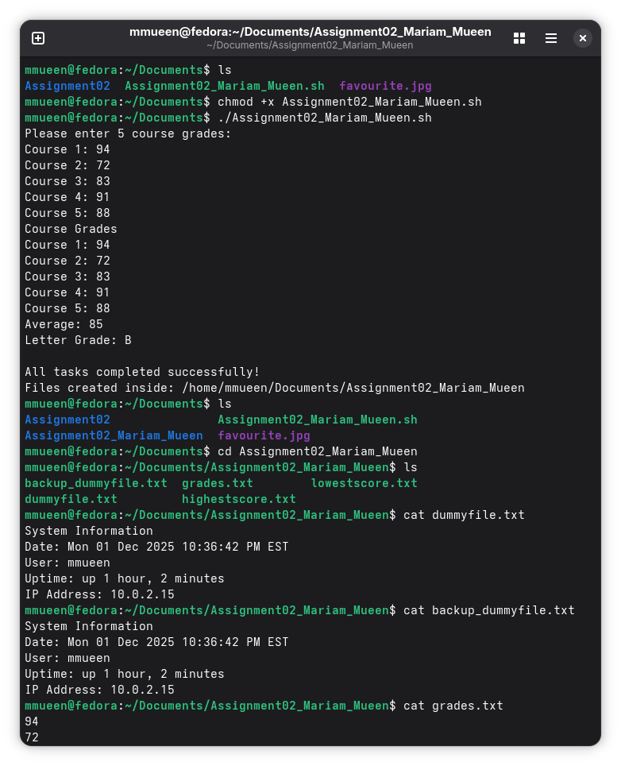
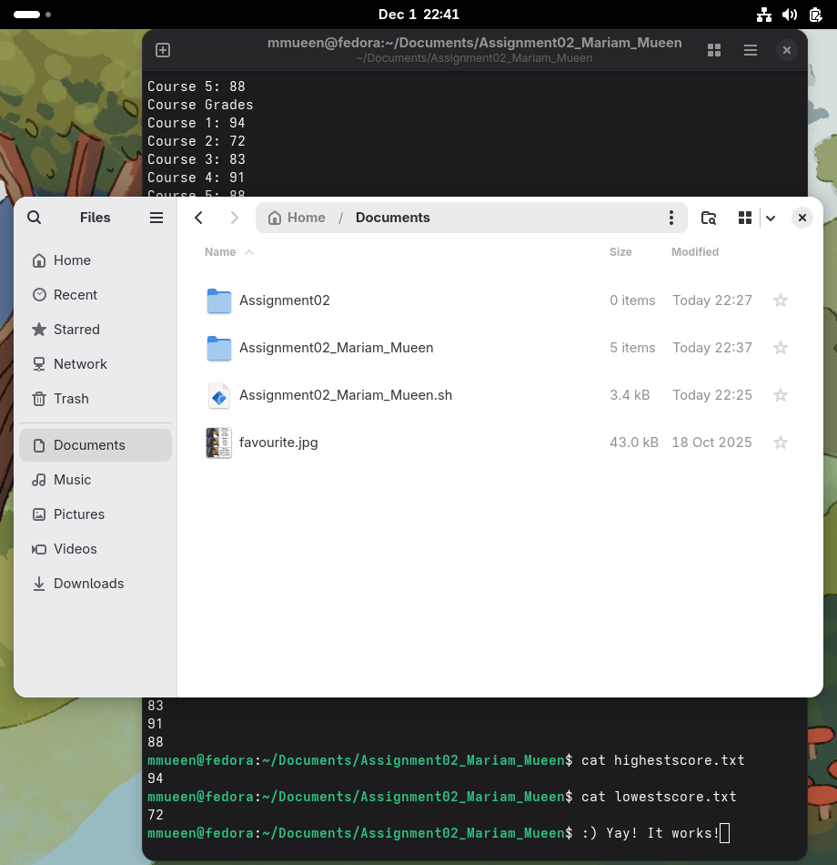
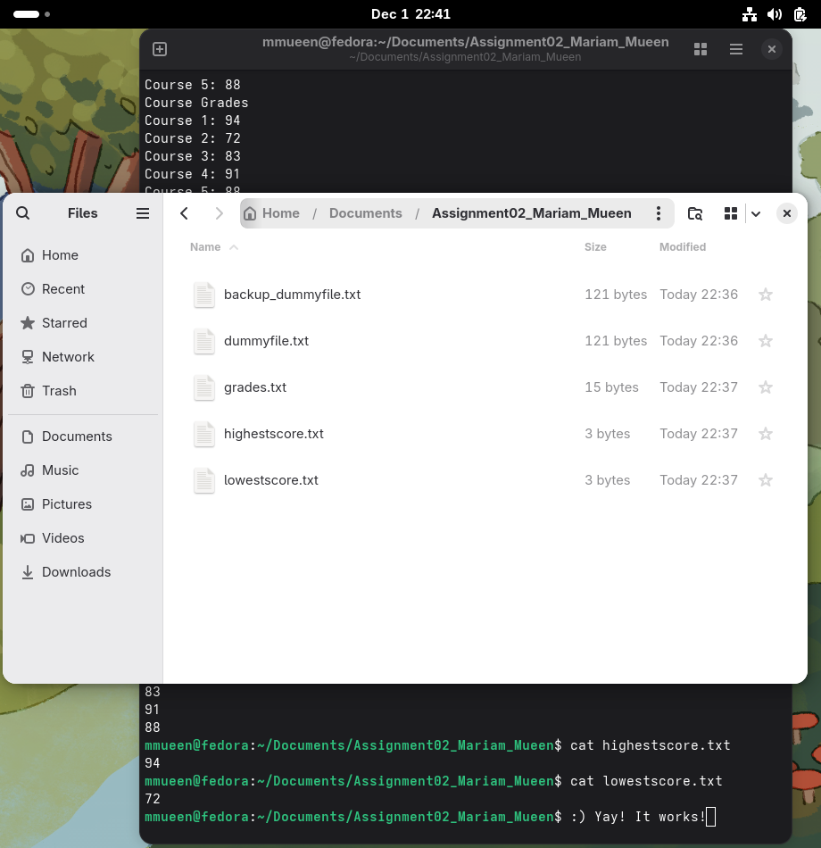

# 02 - System Info and Grade Processing

This folder contains a Bash script that automates folder creation, system information capture, grade processing, backup creation, file permission changes, and highest/lowest score extraction.

## File

- `system_info_grade_report.sh`

## What the Script Does

This script:

- creates a working folder inside `~/Documents`
- accepts five course grades
- creates `grades.txt`
- creates `dummyfile.txt` with:
  - current date
  - current username
  - system uptime
  - machine IP address
  - course grades
  - average
  - letter grade
- creates `backup_dummyfile.txt`
- sets secure permissions on generated files
- creates `highestscore.txt`
- creates `lowestscore.txt`

## Skills Demonstrated

- Bash scripting
- file and directory automation
- Linux permissions with `chmod`
- output redirection
- system information commands
- numeric sorting with `sort -n`
- using `head` and `tail`
- validation with `cat`, `diff`, and `ls -l`

## Output Files

- `dummyfile.txt` - stores system information such as date, username, uptime, and IP address
- `backup_dummyfile.txt` - backup copy of `dummyfile.txt`
- `grades.txt` - stores the five entered course grades
- `highestscore.txt` - stores the highest grade
- `lowestscore.txt` - stores the lowest grade

## Screenshots

### Make the script executable


### Run the script and enter grades


### Check generated files and dummyfile


### Check grades, highest, and lowest


### Documents folder view


### Generated files folder view


## Run

From the repo root:

```bash
chmod +x 02-system-info-and-grade-processing/system_info_grade_report.sh
./02-system-info-and-grade-processing/system_info_grade_report.h