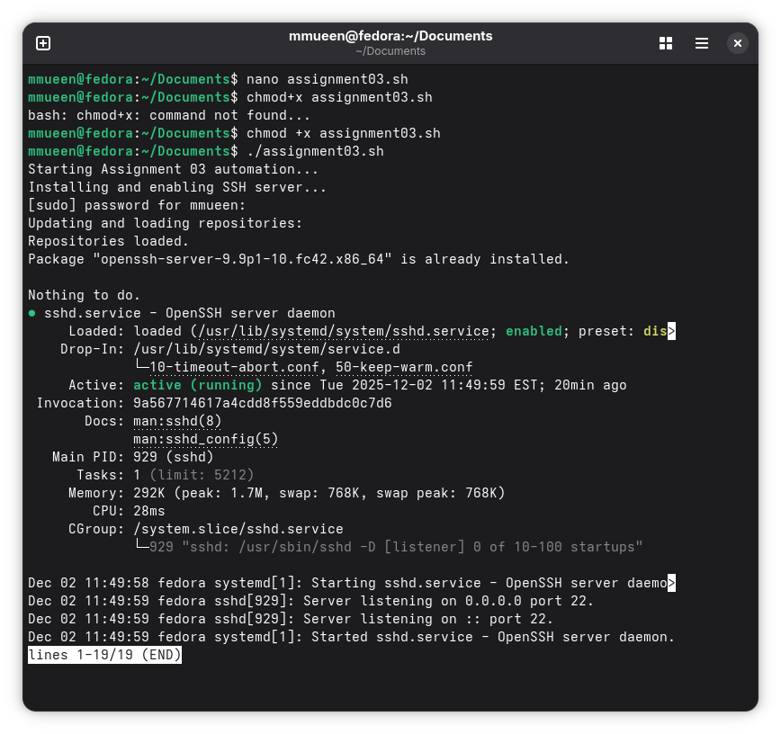
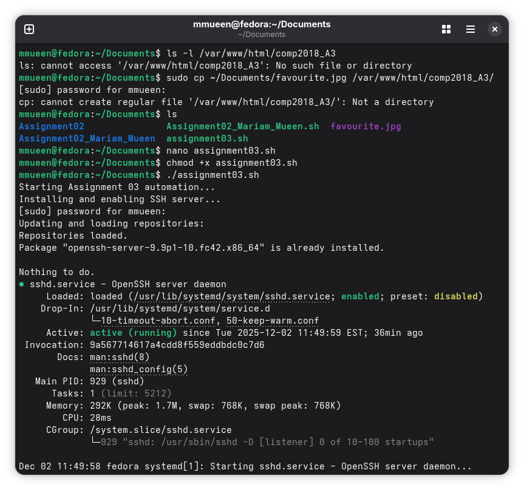
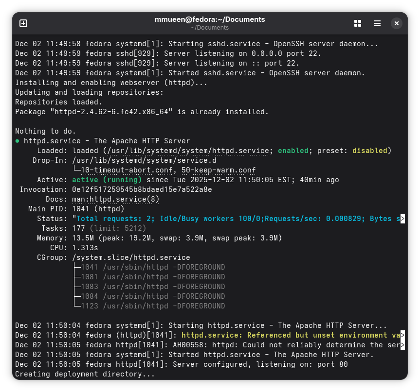
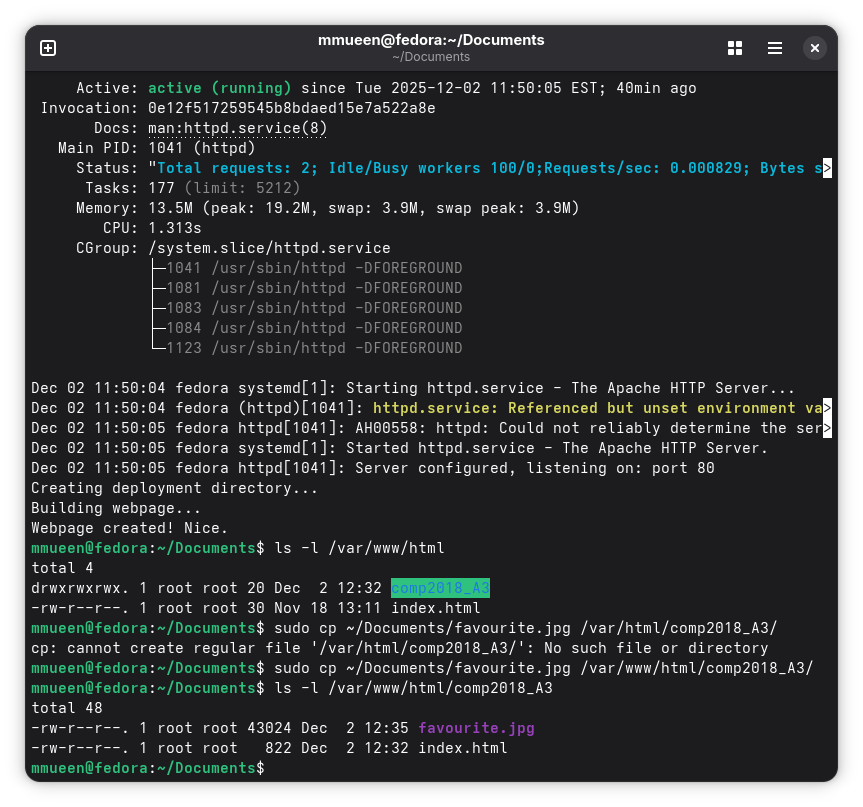
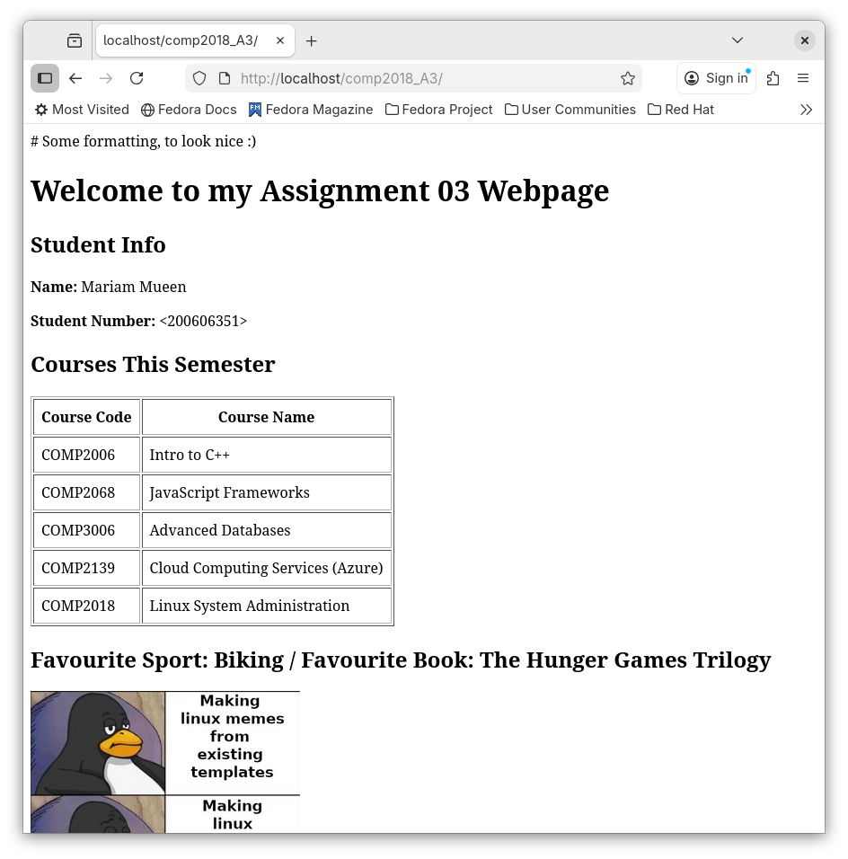
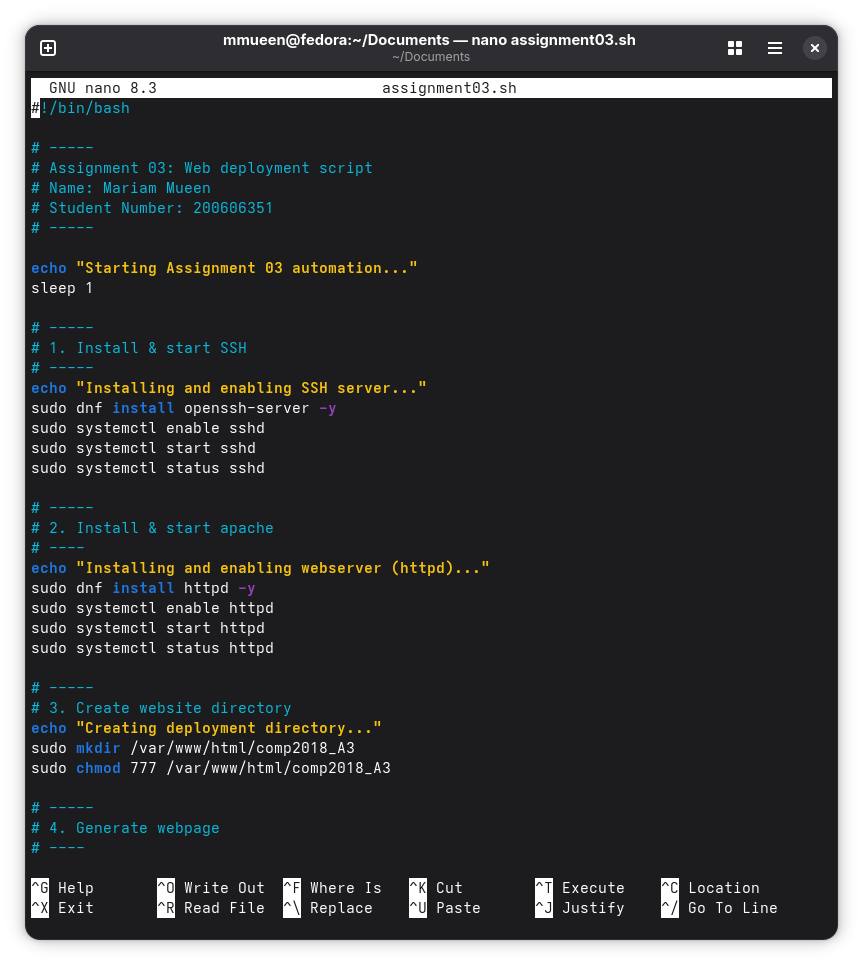
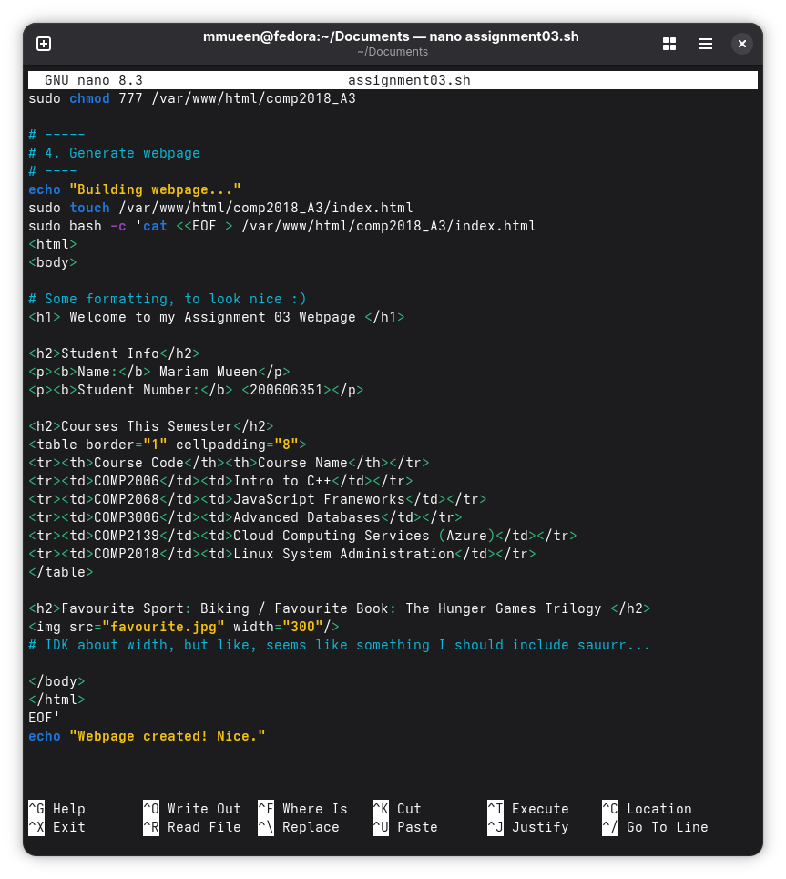
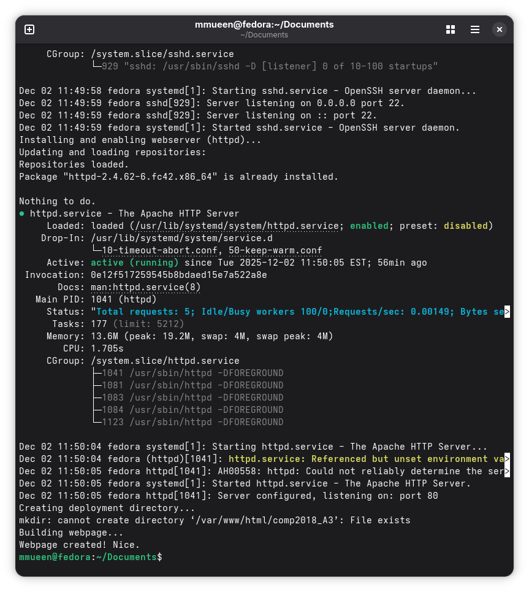
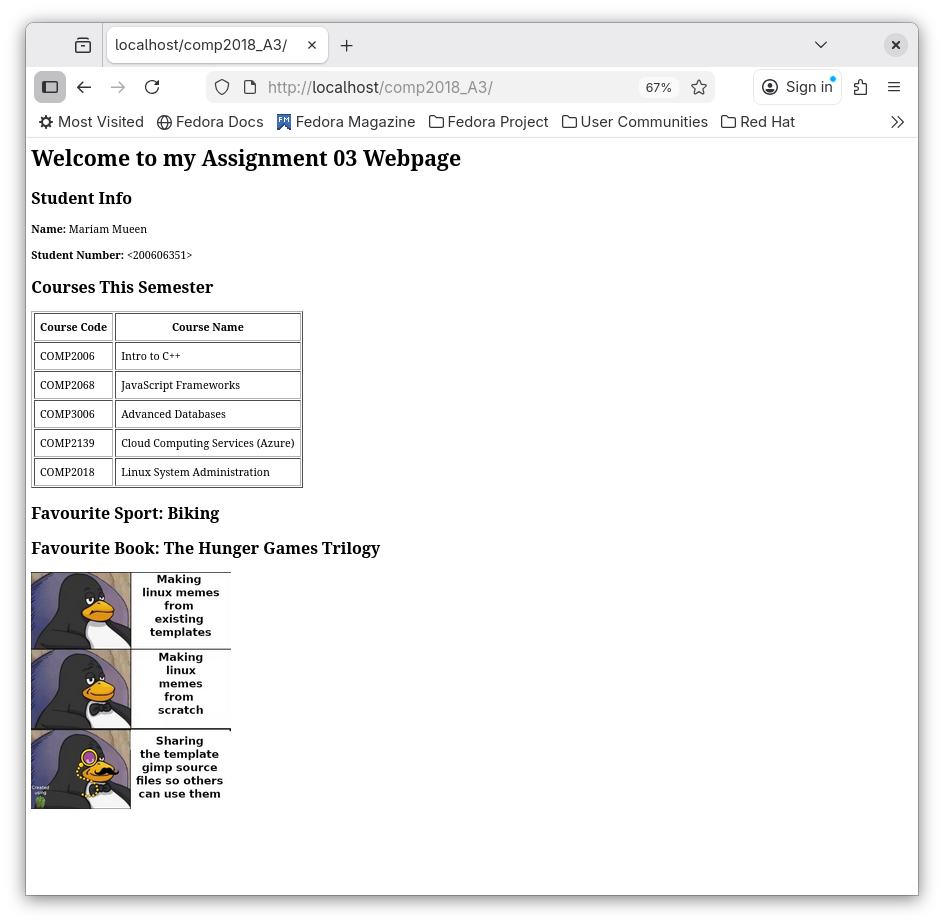

# 03 - Web Server and Static Site Deployment

Built a Bash-based Linux deployment script to automate OpenSSH and Apache installation, configure services with `systemd`, create and populate a web root under `/var/www/html`, generate a static HTML page from script output, deploy media assets, and validate the hosted site through localhost and browser testing on Fedora.

## File

- `apache_ssh_site_deploy.sh`

## What the Script Does

This script:

- installs `openssh-server`
- enables and starts the `sshd` service
- installs Apache (`httpd`)
- enables and starts the `httpd` service
- creates a website deployment directory inside `/var/www/html`
- generates an `index.html` webpage from within the Bash script
- adds student information and a course table to the webpage
- copies a local image into the website directory
- applies SELinux content context if needed
- serves the webpage through Apache
- prints localhost and network URLs for testing

## Skills Demonstrated

- Bash scripting
- Linux package management with `dnf`
- service management with `systemctl`
- SSH server setup
- Apache web server deployment
- Linux filesystem and directory management
- file copying and deployment
- static HTML generation from Bash
- local web hosting on Fedora
- browser-based validation and testing
- basic SELinux-aware deployment workflow

## Deployment Output

- `index.html` created in `/var/www/html/comp2018_A3`
- `favourite.jpg` copied into the same deployment directory
- website accessible through:
  - `http://localhost/comp2018_A3/`
  - `http://<machine-ip>/comp2018_A3/`

## Screenshots

### Create and run the script


### SSH service setup output


### Apache service setup output


### Deployment directory and file copy


### Webpage browser result


### Script source header


### Script HTML generation section


### Rerun script output
.png)

### Apache output and existing directory message


### Updated webpage browser result


## Run

From the repo root:

```bash
chmod +x 03-web-server-and-static-site-deployment/apache_ssh_site_deploy.sh
./03-web-server-and-static-site-deployment/apache_ssh_site_deploy.sh