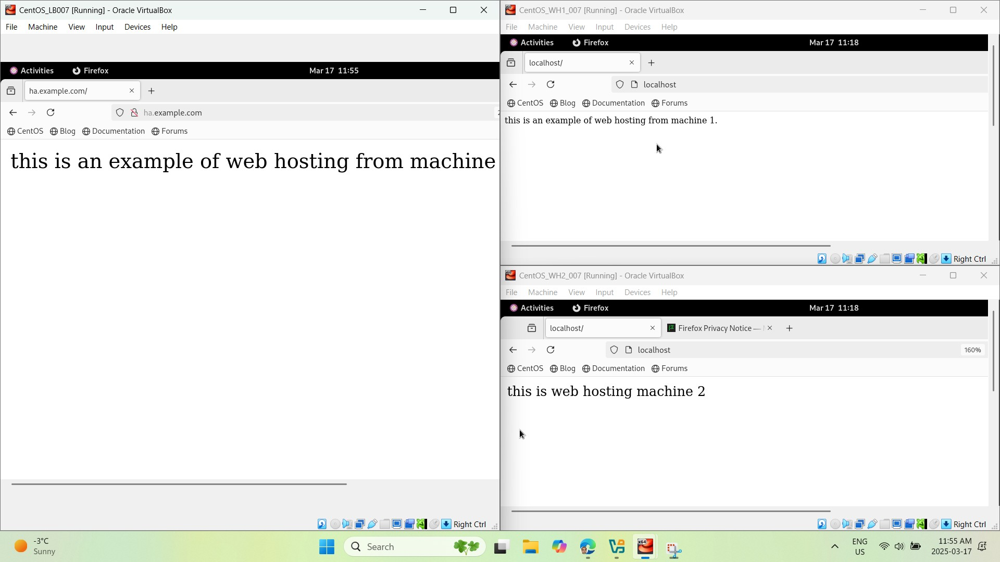
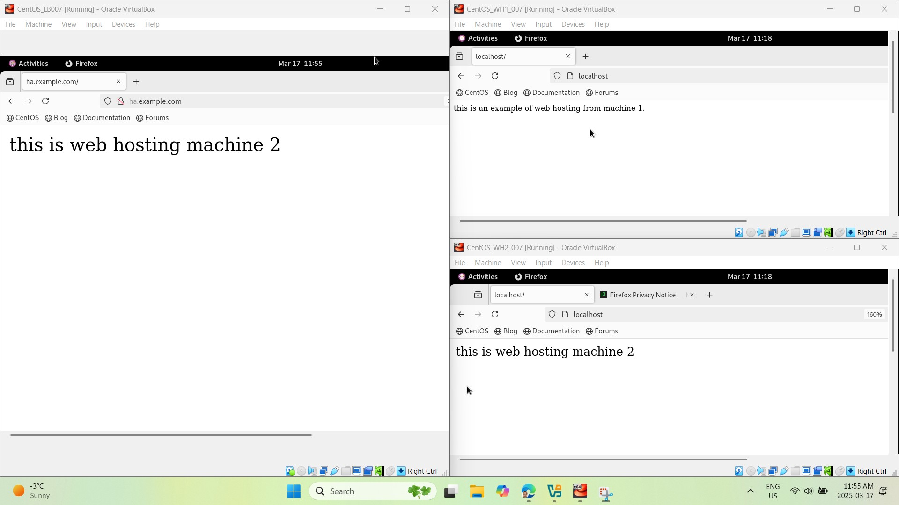
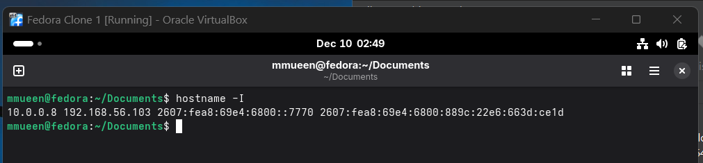

# 04 - NGINX Load Balancing and Multi-Node Web Hosting

This folder contains Bash scripts for configuring a multi-node Linux web hosting environment using NGINX as a load balancer and Apache as the backend web server on two separate nodes.

## Description

Configured a three-node Linux web hosting environment with NGINX load balancing on the front end and Apache web servers on two backend nodes, including firewall rules, SELinux proxy permissions, hostname mapping, and browser-based load distribution testing.

## Files

- `load_balancer_setup.sh`
- `web_node_setup.sh`

## What the Scripts Do

### `load_balancer_setup.sh`
This script:

- installs NGINX on the load balancer node
- updates `/etc/hosts` with the load balancer and backend server mappings
- configures an `upstream backend` block in `nginx.conf`
- proxies requests from the load balancer to two backend servers
- opens HTTP in the firewall
- enables SELinux network connection permissions for proxying
- starts and enables the NGINX service

### `web_node_setup.sh`
This script:

- removes NGINX if present on backend nodes
- installs Apache (`httpd`)
- enables and starts the Apache service
- backs up the default `index.html`
- creates a custom webpage for each backend node
- opens HTTP in the firewall

## Skills Demonstrated

- Bash scripting
- NGINX load balancer configuration
- reverse proxy setup
- Apache web server deployment
- multi-node Linux hosting
- `/etc/hosts` configuration
- firewall management with `firewall-cmd`
- SELinux configuration with `setsebool`
- service management with `systemctl`
- browser-based validation of load-balanced traffic
- Round Robin load balancing concepts

## Deployment Overview

- **Machine 1:** NGINX load balancer
- **Machine 2:** Apache backend web server 1
- **Machine 3:** Apache backend web server 2

Requests sent to the load balancer are forwarded to the two backend Apache nodes.

## Screenshots

### Load-balanced browser validation

This screenshot shows three VM/browser views at once:
- the left side is the load balancer URL `ha.example.com/`
- the top-right browser shows machine 1’s backend page
- the bottom-right browser shows machine 2’s backend page

This demonstrates that separate backend pages exist and that the HA endpoint is serving one of them.



### Backend browser comparison

This screenshot shows the HA endpoint displaying the content from machine 2, while the backend windows still show machine 1 and machine 2 separately. This helps verify that the load balancer can route requests to different backend nodes.



### Clone 1 IP address output

This screenshot shows the result of `hostname -I`, confirming multiple IP addresses for the VM and helping identify the correct bridged-network address for multi-VM testing.



## Run

### Load balancer node

```bash
chmod +x 04-nginx-load-balancing-and-multi-node-web-hosting/load_balancer_setup.sh
./04-nginx-load-balancing-and-multi-node-web-hosting/load_balancer_setup.sh