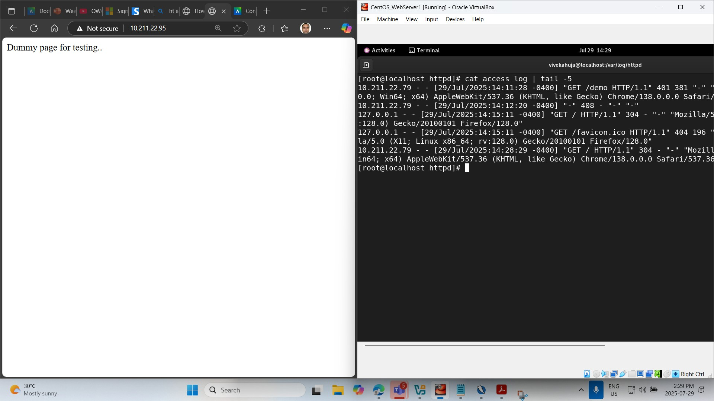
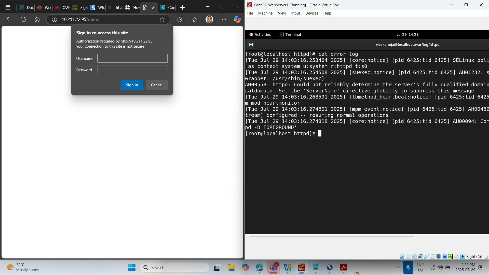
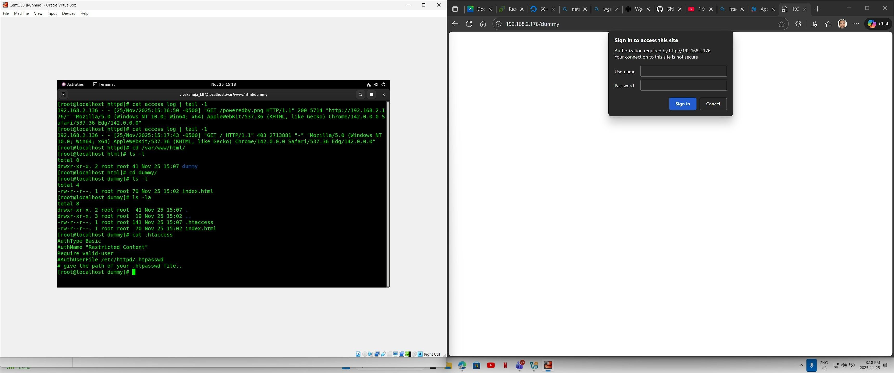

# 05 - Apache HTAccess Security and Access Control

This folder contains a Bash script that automates Apache installation, sample site deployment, and `.htaccess`-based Basic Authentication for a protected website directory.

## File

- `apache_htaccess_security_setup.sh`

## Description

Built a Bash automation script to deploy Apache on Linux, generate a sample site under `/var/www/html`, configure `.htaccess` and `.htpasswd` for Basic Authentication, and validate protected access through browser prompts and Apache log inspection.

## What the Script Does

This script:

- installs Apache (`httpd`)
- enables and starts the Apache service
- creates a deployment folder inside `/var/www/html`
- generates a sample `index.html` page
- includes the current date and active courses in the webpage
- creates a `.htaccess` file for Basic Authentication
- creates a `.htpasswd` file for user credentials
- updates Apache settings to allow `.htaccess` overrides
- restarts Apache
- prints the local test URL and log-check command

## Skills Demonstrated

- Bash scripting
- Apache web server deployment
- `.htaccess` access control
- Basic Authentication setup
- protected directory configuration
- service management with `systemctl`
- Linux web root deployment
- Apache log inspection
- browser-based authentication testing
- access control troubleshooting

## Deployment Output

- protected site created inside `/var/www/html/<folder-name>`
- `index.html` deployed to the protected directory
- `.htaccess` configured for Basic Authentication
- `.htpasswd` created for authorized user login
- browser prompts for username and password when accessing the protected route

## Screenshots

### Initial test page and Apache access log


### Browser authentication prompt and Apache error log


### Protected directory with `.htaccess` and browser login prompt


### Protected page retest and access log output


### Protected directory and authentication prompt


### Script source for Apache and webpage setup


## Run

```bash
chmod +x 05-apache-htaccess-security-and-access-control/apache_htaccess_security_setup.sh
./05-apache-htaccess-security-and-access-control/apache_htaccess_security_setup.sh